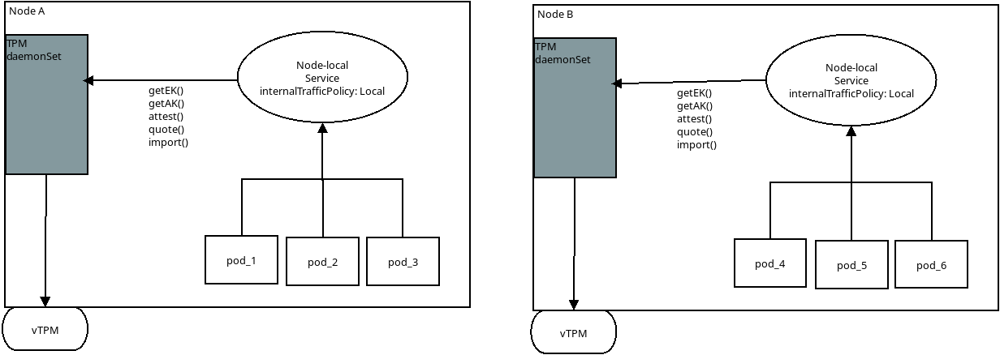

## Kubernetes Trusted Platform Module (TPM) DaemonSet 

Simple kubernetes [DaemonSet](https://kubernetes.io/docs/concepts/workloads/controllers/daemonset/) which surfaces node-specific TPM operations.

Specifically, this daemonset allows the containers the ability to interact with the node's TPM though gRPC APIs:

Normally, an application accesses the TPM by directly interacting with the `/dev/tpm0` device.  In the case of GKE, that device is not readily visible to the container without setting the [privileged: true](https://gist.github.com/salrashid123/e2c336e26fc7fc06312e9f2c07857e5a) security context to the pod (which is risky).

The sample here runs a daemonset which does have access to the host's TPM via volume mounts and surfaces several common TPM operations as a gRPC service.

The specific operations contained here are

* TPM [Remote Attestation](https://tpm2-software.github.io/tpm2-tss/getting-started/2019/12/18/Remote-Attestation.html)

  Allows remote parties to confirm signing and encryption keys are associated with a specific TPM

* TPM [Quote-Verify](https://github.com/salrashid123/tpm2/tree/master/quote_verify)

  Allows for verification of PCRs and Eventlogs on the TPM

* PCR bound Transfer of sensitive data (encryption keys)

  This allows decryption of arbitrary data in a way that it can *only* be done on that TPM

* on-TPM RSA Key generation and signature

  Allows the TPM to generate a remote provable/attested RSA key that will exist *only* on that TPM.  
  The key can be used to sign data ensuring an operation happened on a given TPM



The specific gRPC interfaces for the above are:

```proto
option go_package = "github.com/salrashid123/tpm_daemonset/verifier";

service Verifier {
  // get endorsement key
  rpc GetEK (GetEKRequest) returns (GetEKResponse) { }

  // get an attestation key
  rpc GetAK (GetAKRequest) returns (GetAKResponse) { }

  // remote attestation
  rpc Attest (AttestRequest) returns (AttestResponse) { }

  // quote/verify
  rpc Quote (QuoteRequest) returns (QuoteResponse) { }

  // decrypt an external encrypted secret on the TPM
  //  the secret is encrypted using that tpm's EK
  rpc ImportBlob (ImportBlobRequest) returns (ImportBlobResponse) { }

  // (unimplemented) load an encrypted external RSA key into TPM
  //   RSA key is encrypted using that tpm's EK
  rpc ImportSigningKey (ImportSigningKeyRequest) returns (ImportSigningKeyResponse) { }

  //  generate a new RSA key embedded on the TPM
  rpc NewKey (NewKeyRequest) returns (NewKeyResponse) { }

  // use embedded TPM rsa key to sign data
  rpc Sign (SignRequest) returns (SignResponse) { }
}
```

The daemonset's API access is visible to the pods in that same node enforced though the `internalTrafficPolicy: Local` directive

```yaml
apiVersion: v1
kind: Service
metadata:
  name: tpm-service
spec:
  internalTrafficPolicy: Local
  selector:
    name: tpm-ds
  ports:
  - name: http-port
    protocol: TCP
    port: 50051
```

>> note: this repo and code is **not** supported by Google

---

#### References

* [go-attestation](https://github.com/google/go-attestation)
* [go-tpm-tools](https://github.com/google/go-tpm-tools)
* [TPM Remote Attestation protocol using go-tpm and gRPC](https://github.com/salrashid123/go_tpm_remote_attestation)
* [Sealing RSA and Symmetric keys with GCP vTPMs](https://github.com/salrashid123/gcp_tpm_sealed_keys#sealed-asymmetric-key)
* [Trusted Platform Module (TPM) recipes with tpm2_tools and go-tpm](https://github.com/salrashid123/tpm2)

also see [TODO.md](TODO.md)

---

### Build

You can either use the built image:
`index.docker.io/salrashid123/tpmds@sha256:ab96dceac23dcc4171dd9556e2c1d22033f21261b1d90ce643a129d46d1878a4`

or the daemonset was built using Kaniko:

```bash
 docker run   \
  -v `pwd`:/workspace -v $HOME/.docker/config_docker.json:/kaniko/.docker/config.json:ro \
   -v /var/run/docker.sock:/var/run/docker.sock \
     gcr.io/kaniko-project/executor@sha256:034f15e6fe235490e64a4173d02d0a41f61382450c314fffed9b8ca96dff66b2    \
	 --dockerfile=Dockerfile \
	 --reproducible   \
	     --destination "docker.io/salrashid123/tpmds:server"       --context dir:///workspace/
```

### Run

To use, simply create a GKE cluster, deploy 

```bash
gcloud container clusters create cluster-1  \
   --region=us-central1 --machine-type=n2d-standard-2 --enable-confidential-nodes \
   --enable-shielded-nodes --shielded-secure-boot --shielded-integrity-monitoring --num-nodes=1 --enable-network-policy

$ cd example/
$ kubectl apply -f .
$ kubectl get po,svc,no -o wide
NAME                       READY   STATUS    RESTARTS   AGE   IP           NODE                                       NOMINATED NODE   READINESS GATES
pod/app-6d87985b5f-c5wkj   1/1     Running   0          22s   10.60.0.14   gke-cluster-1-default-pool-0b6d4c85-j3ln   <none>           <none>
pod/tpm-ds-547kl           1/1     Running   0          21s   10.60.2.9    gke-cluster-1-default-pool-886e5e15-59xm   <none>           <none>
pod/tpm-ds-b8qln           1/1     Running   0          21s   10.60.1.12   gke-cluster-1-default-pool-1bcbb7ab-fnq8   <none>           <none>
pod/tpm-ds-cjmhp           1/1     Running   0          21s   10.60.0.15   gke-cluster-1-default-pool-0b6d4c85-j3ln   <none>           <none>

NAME                  TYPE        CLUSTER-IP   EXTERNAL-IP   PORT(S)     AGE   SELECTOR
service/kubernetes    ClusterIP   10.64.0.1    <none>        443/TCP     66m   <none>
service/tpm-service   ClusterIP   10.64.8.14   <none>        50051/TCP   21s   name=tpm-ds

NAME                                            STATUS   ROLES    AGE   VERSION           INTERNAL-IP   EXTERNAL-IP      OS-IMAGE                             KERNEL-VERSION   CONTAINER-RUNTIME
node/gke-cluster-1-default-pool-0b6d4c85-j3ln   Ready    <none>   64m   v1.25.8-gke.500   10.128.0.53   34.67.75.104     Container-Optimized OS from Google   5.15.89+         containerd://1.6.18
node/gke-cluster-1-default-pool-1bcbb7ab-fnq8   Ready    <none>   64m   v1.25.8-gke.500   10.128.0.54   35.193.152.237   Container-Optimized OS from Google   5.15.89+         containerd://1.6.18
node/gke-cluster-1-default-pool-886e5e15-59xm   Ready    <none>   64m   v1.25.8-gke.500   10.128.0.55   34.123.40.83     Container-Optimized OS from Google   5.15.89+         containerd://1.6.18


$ kubectl exec --stdin --tty pod/app-6d87985b5f-c5wkj -- /bin/bash

$ cd /app
$ go run grpc_verifier.go -host tpm-service:50051 \
   -uid 121123 -kid 213412331 \
   -caCertTLS /certs/root.pem --v=10 -alsologtostderr

```

The output on the verifier will show the outputs of the end-to-end tests:

Note that each invocation returns the EKCert issued to the same NodeVM (in our ase, its `gke-cluster-1-default-pool-7c317a84-nfc1`)...and thats just where the app pod was deployed.  

The EKCert shown in this repo uses the specific certificates signed by google and is verified by the client itself.

```log
root@app-6d87985b5f-c5wkj:/app# go run grpc_verifier.go -host tpm-service:50051 \
   -uid 121123 -kid 213412331 \
   -caCertTLS /certs/root.pem --v=10 -alsologtostderr

I0613 17:12:30.770562      57 grpc_verifier.go:114] RPC HealthChekStatus:SERVING
I0613 17:12:30.771161      57 grpc_verifier.go:116] =============== start GetEK ===============
I0613 17:12:30.772431      57 grpc_verifier.go:133]      EKPub: 
-----BEGIN PUBLIC KEY-----
MIIBIjANBgkqhkiG9w0BAQEFAAOCAQ8AMIIBCgKCAQEAorUXVOJnTn/jDIpFMW85
aLsWvzVe8fBjPfNVyq7bMkbq8ZyJUOka8Nh5Stzcfy8mNDRo6PpIx7S1gJr4Qk6X
7BV49Fs+vwnBLWsuSCUgBnn60+HntE/t/4iaVX8w5sLIR7T5g4U+IJli7vegABwX
BHF45+hmQM0O9/WlzUhIREzSIMAtCVIMomCRq5Ymn3+v+kyNOoI9Cp6UvRIJH/Gx
5Qw2x2C3lS9YL8bEEmkkKYPLieyVwRtqKvzB/V/LW0mYdL2u5GpFCPv2QfPwSrBW
6E/iTE2vDEKEA2cL2jxnRzntUW6GYaFWYVXyWfHUSJsMmSljJ5TOrxcWbY3ftOLn
xwIDAQAB
-----END PUBLIC KEY-----

I0613 17:12:30.772602      57 grpc_verifier.go:147] =============== end GetEKCert ===============
I0613 17:12:30.772660      57 grpc_verifier.go:149] =============== start GetAK ===============
I0613 17:12:30.985930      57 grpc_verifier.go:189]       ak public 
-----BEGIN PUBLIC KEY-----
MIIBIjANBgkqhkiG9w0BAQEFAAOCAQ8AMIIBCgKCAQEApoS2wDe2ft3vqy+4+lVD
kke9w8CVAPXPU/xQrylXJF5CrZUg30EyubjNlL6wZhz/JPeXeXlEOBoywfybPcls
Jj+/TC6IM+SRsZt6z9CF7e84zgJwFMLmL2muKAB4yEnzkFhYq1v2ZRP6vsNDCcwN
VQXMWGK86TQfIwSEiaO9rNaoPUEncCB3lkpq7GQEy2DQNE8CTMBGugUJKMG18jvm
VH7b7b0S11g0thn1jdFlD3e1OjYXXQaOuuPs4W0zzcmD83ad5MZ49t994hZwI2An
3CTmCHaICykiYjopBgB3vfXJpiF2589VJIHMxc4HD49J0ipu1R+T3DE9XKt0c9ak
jwIDAQAB
-----END PUBLIC KEY-----

I0613 17:12:30.985974      57 grpc_verifier.go:190] =============== end GetAK ===============
I0613 17:12:30.986128      57 grpc_verifier.go:192] =============== start Attest ===============
I0613 17:12:30.986686      57 grpc_verifier.go:198]       Outbound Secret: lXoUaC17YhaNepgEZhb8tMN56xcp5xIN8yAOtMxrzgk=
I0613 17:12:31.115738      57 grpc_verifier.go:215]       Inbound Secret: lXoUaC17YhaNepgEZhb8tMN56xcp5xIN8yAOtMxrzgk=
I0613 17:12:31.115814      57 grpc_verifier.go:218]       inbound/outbound Secrets Match; accepting AK
I0613 17:12:31.115957      57 grpc_verifier.go:223] =============== end Attest ===============
I0613 17:12:31.116018      57 grpc_verifier.go:225] =============== start Quote/Verify ===============
I0613 17:12:31.291214      57 grpc_verifier.go:278]      quotes verified
I0613 17:12:31.292469      57 grpc_verifier.go:291]      secureBoot State enabled true
I0613 17:12:31.292911      57 grpc_verifier.go:297] =============== end Quote/Verify ===============
I0613 17:12:31.292950      57 grpc_verifier.go:299] =============== start ImportBlob ===============
I0613 17:12:31.292996      57 grpc_verifier.go:301]      importSecret G-KaPdSgUkXp2s5v8y/B?E(H+MbQeThW
I0613 17:12:31.322468      57 grpc_verifier.go:322]      Decrypted key G-KaPdSgUkXp2s5v8y/B?E(H+MbQeThW
I0613 17:12:31.322541      57 grpc_verifier.go:323] =============== end ImportBlob ===============
I0613 17:12:31.322636      57 grpc_verifier.go:325] =============== start NewKey ===============
I0613 17:12:31.579049      57 grpc_verifier.go:336]      newkey Public 
-----BEGIN RSA PUBLIC KEY-----
MIIBIjANBgkqhkiG9w0BAQEFAAOCAQ8AMIIBCgKCAQEA4xKdh+eZT53dak4we858
22sEsFtIl33rRglhTLiaLGvHvJOXFy3tqL1OC/K/pFK0h8h/cITlYwLX8UJS0y/a
BNKEN3EiIUoaBlpLX6vkXAmmpVzH3ADrUYkoXdfSaXuPs89WbAb2FevJFW2wZS6M
B5wQPF8qqVSto24RzFQVAgEgYllTUnahxULf/FiJAw1KaMDg53tIxIbwRQCRWfVw
uVn5GNZIK5ws3OqG25qp6gchdGjy2vBfTqa68GQXo0fRfeKIA4O9znKc0UGwBr4j
KvPFVXXW0U2sOcz6tShCaevSAybndk6vDnBidDgsxEKMSjx2fxDvhbJ/0GZkVJwE
6wIDAQAB
-----END RSA PUBLIC KEY-----
I0613 17:12:31.579443      57 grpc_verifier.go:353]      new key verified
I0613 17:12:31.579516      57 grpc_verifier.go:354] =============== end NewKey ===============
I0613 17:12:31.579554      57 grpc_verifier.go:356] =============== start Sign ===============
I0613 17:12:31.626841      57 grpc_verifier.go:369]      signature: g1FqtWXDposR1Wb1eYJ2J+BRVIFDfRl1XOfQVJLHKpcY2sx7oGgltjEKC/wnQdkRRwQWwUnXRIM6wocJshPC56Oh+EmEQwuNL4+LsRWf0l2o0ATgwlBaZsWBT1z2iQEc6cNLLfb1HKnjWg43x4x7g6I+DWmVnTbzRh0Bqs2QZQbNdbAFLB6W8TYXfljUodNC8HYD6vlLOBnyZ4PNrSP+HHRCd6q3J/ST8I4V5o7BinrI1e3sWWxSOdZsXZwJmrOH4WYCKFiAr/LoZY2pKO1J/IHgBMut1kRZdqJv8iMfY/NHUmG0QyGy1ZK2J7WqYwUTobkGu6Wi7WD7bW67gu0yEg==
I0613 17:12:31.627198      57 grpc_verifier.go:392]      signature verified
I0613 17:12:31.627273      57 grpc_verifier.go:393] =============== end Sign ===============

```

Which corresponds to basic server output (you can increase the verbosity logging flag on boot)

```log
$ kubectl logs tpm-ds-cjmhp

I0613 17:11:18.370175       1 grpc_attestor.go:528] Getting EKCert reset
I0613 17:11:18.555103       1 grpc_attestor.go:585] Starting gRPC server on port :50051
I0613 17:12:30.769587       1 grpc_attestor.go:90] HealthCheck called for Service [attest.Attestor]
I0613 17:12:30.771706       1 grpc_attestor.go:104] ======= GetEK ========
I0613 17:12:30.774282       1 grpc_attestor.go:130] ======= GetAK ========
I0613 17:12:30.987369       1 grpc_attestor.go:189] ======= Attest ========
I0613 17:12:31.116804       1 grpc_attestor.go:239] ======= Quote ========
I0613 17:12:31.294169       1 grpc_attestor.go:297] ======= ImportBlob ========
I0613 17:12:31.323555       1 grpc_attestor.go:344] ======= NewKey ========
I0613 17:12:31.580026       1 grpc_attestor.go:428] ======= Sign ========
```

---

#### EKCert and AKCert on GCE

At the time of writing (`6/13/23`), GKE and general GCE VMs do _not_ populate the provider-signed endorsement or attestation certificates.

What this means is you need to find some alternate way to trust the EKPublic key for remote attestation.

One way maybe to allow the verifier access to read a GCE VM's metadata via GCP APIs (i.e, the verifier would run the gcloud command in following which is similar to the last option described in [TPM Key Attestation](https://learn.microsoft.com/en-us/windows-server/identity/ad-ds/manage/component-updates/tpm-key-attestation#BKMK_DeploymentOverview):

- [GCE EK/AK PubKey and Certs](https://github.com/salrashid123/go_tpm_remote_attestation#ekcert-and-akcert)

#### Testing remote clients

If you want to run a verifier from outside the GKE cluster (i.,e from your laptop), enable the `LoadBalancer` construct

```yaml
---
apiVersion: v1
kind: Service
metadata:
  name: tpm-service-external
spec:
  type: LoadBalancer  
  selector:
    name: tpm-ds
  ports:
  - name: http-port
    protocol: TCP
    port: 50051

```

and disable the `NetworkPolicy` which would otherwise only allow the internal traffic

Apply 
```bash

$ gcloud compute firewall-rules create allow-tpm-verifier  --action allow --direction INGRESS   --source-ranges 0.0.0.0/0    --rules tcp:50051

$ kubectl delete networkpolicy/allow-tpm   

$ kubectl get svc
  NAME                           TYPE           CLUSTER-IP     EXTERNAL-IP    PORT(S)           AGE     SELECTOR
  service/tpm-service-external   LoadBalancer   10.64.10.161   34.28.252.62   50051:32280/TCP   6m19s   name=tpm-ds

# use external LB address
$ go run grpc_verifier.go -host 34.28.252.62:50051    -uid 121123 -kid 213412331    -caCertTLS ../../certs/root.pem --v=10 -alsologtostderr
```

#### EventLog

The quote-verify step provides the full eventlog which is validated against all PCR values.

A verifier can use the eventlog to check for certain measurements in an easier to read format than just trusting a sumtotal of a given PCR hash.

As an example, see [TPM EventLog value for GCE Confidential VMs (SEV)](https://gist.github.com/salrashid123/0c7a4a6f7465cff19d05ac50d238cd57)

Also see:

* [TCG Guidance on Integrity Measurements and Event Log Processing (pg15)](https://trustedcomputinggroup.org/wp-content/uploads/TCG-Guidance-Integrity-Measurements-Event-Log-Processing_v1_r0p118_24feb2022-1.pdf)
* [Verifying TPM Boot Events and Untrusted Metadata](https://github.com/google/go-attestation/blob/master/docs/event-log-disclosure.md#event-type-and-verification-footguns)

#### TLS with Attested keys

The proto definition 

```proto
  //  generate a new RSA key embedded on the TPM
  rpc NewKey (NewKeyRequest) returns (NewKeyResponse) { }
```

returns a new RSA key thats bound to the TPM and attested by the attestation key (meaning you know it exists on the node).

With a small modification to return an Elliptic Key instead of an RSA one could allow the vm to start a _new TLS Socket_ that uses the private key on the tpm.

For an example of that, see

* [TPM based TLS using Attested Keys](https://github.com/salrashid123/tls_ak)